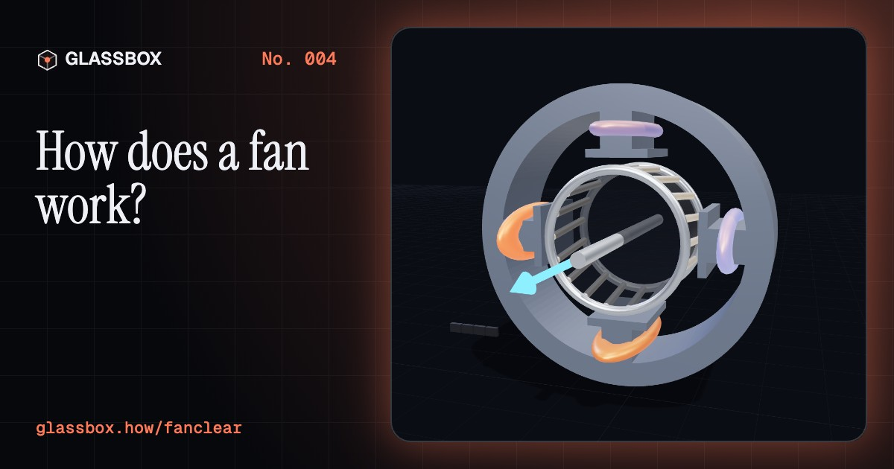
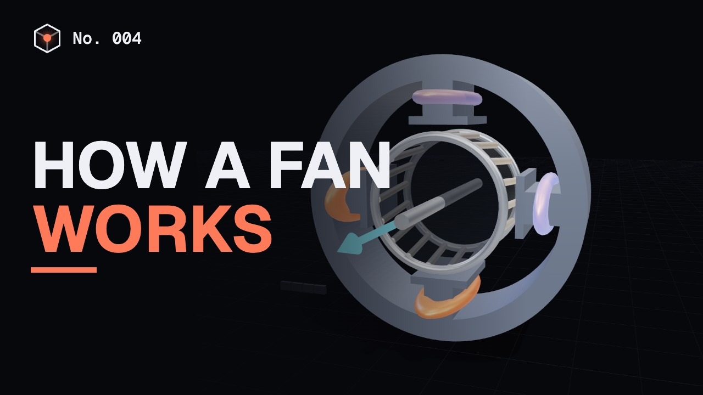
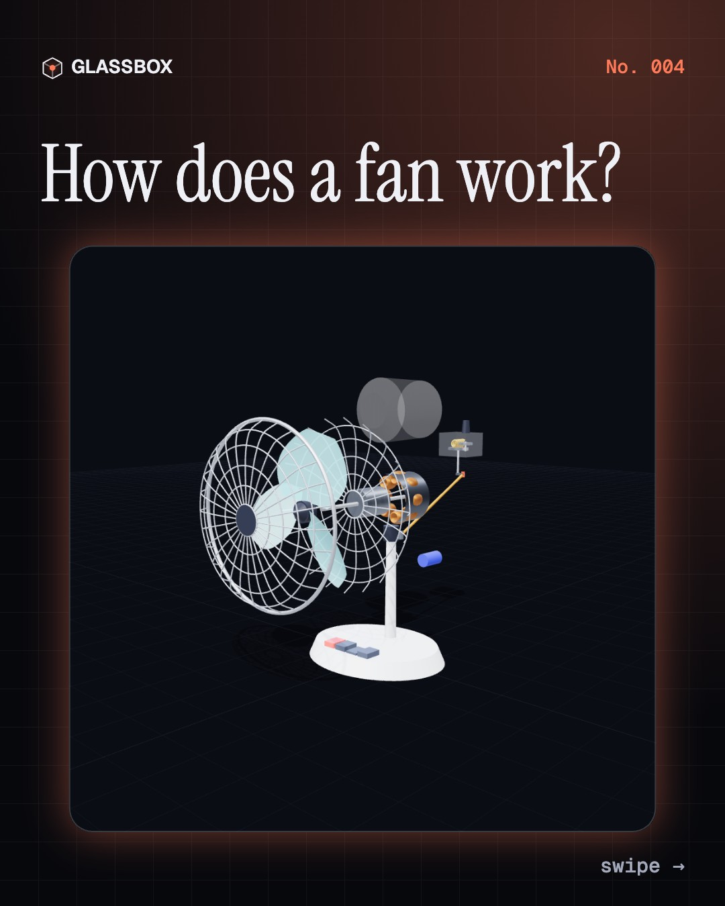
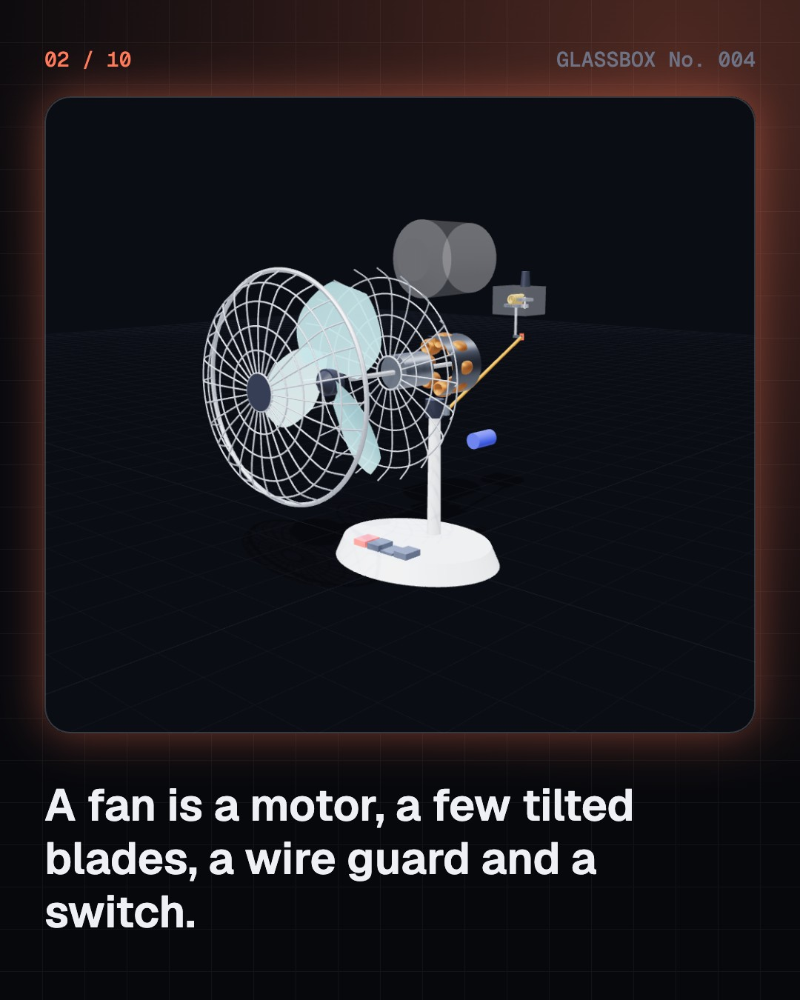
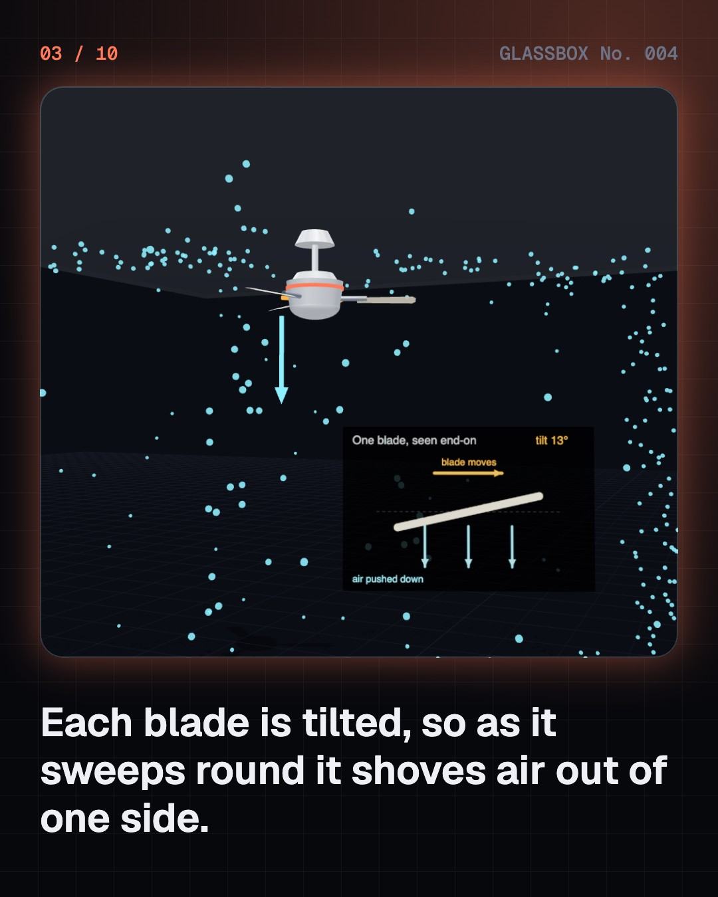
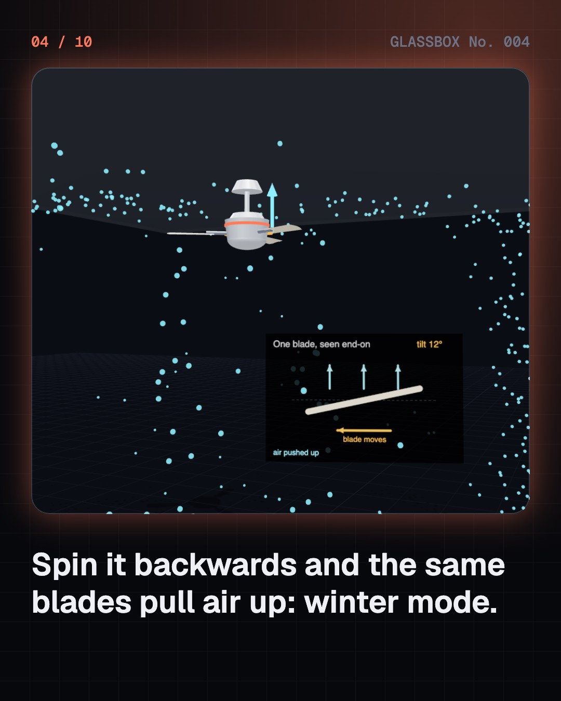

<!-- glassbox:start -->
<!-- Generated from glassbox.json by the Glassbox hub (npm run readme -- fanclear). Edit glassbox.json, not this block. -->
<p align="center"><a href="https://glassbox.how/e/fanclear/"></a></p>

<h1 align="center">FanClear</h1>

<p align="center"><b>How does a fan work?</b><br>Tilted blades, a magnetic field that spins, and a breeze that cools you without cooling the air. Take a fan apart in 3D and see why half speed costs one eighth of the power.</p>

<p align="center"><a href="https://glassbox.how/fanclear/"><b>▶ Play with it</b></a> &nbsp;·&nbsp; <a href="https://glassbox.how/e/fanclear/">Read the 60-second explainer</a> &nbsp;·&nbsp; <a href="https://glassbox.how/fanclear/glassbox/reel.mp4">Watch the 40-second video</a></p>

<p align="center">
  <a href="https://glassbox.how/e/fanclear/"></a>
  <a href="https://glassbox.how/e/fanclear/"></a>
  <a href="LICENSE"></a>
  <a href="LICENSE-CONTENT.md"></a>
  <a href="#privacy"></a>
</p>

## In 60 seconds

1. **A motor, blades, a guard and a switch.** An electric fan is a motor with a hub of tilted blades on its shaft, a wire guard around them, and a switch or regulator to set the speed. A desk fan also has a small gearbox that swings its head.
2. **Tilted blades push the air.** Each blade is tilted, with its leading edge higher than its trailing edge. As it sweeps round, the slope shoves air out of one side of the fan, like a propeller. Spin a ceiling fan backwards and the same blades pull air up instead.
3. **A magnetic field that turns.** In an induction motor, two sets of coils are fed so their currents peak one after the other, thanks to a capacitor. Together they make a magnetic field that rotates. It induces currents in the rotor's metal bars and drags the rotor round, always a few percent behind.
4. **Half the speed, one eighth of the power.** Airflow grows in step with a fan's speed, the push it makes grows with speed squared, and the power it needs grows with speed cubed. That is why low regulator steps save so much energy, and why BLDC fans that run on about 30 W instead of 75 W matter.
5. **It cools you, not the room.** A fan does not lower the air temperature. Its motor even adds a little heat. It feels cool because moving air strips away the warm, damp layer on your skin and helps sweat evaporate. A 1 m/s breeze feels about 3 to 4 °C cooler.
6. **A worm gear swings the head.** Behind the motor, a worm on the shaft turns a worm wheel one tooth per turn. With one more pair of gears, the motor is slowed about 240 times. A crank and a link tied to the stand turn that slow rotation into a side-to-side swing.

## Words worth knowing

| Term | Meaning |
|---|---|
| **Pitch** | How steeply a blade is tilted from the plane it spins in. Ceiling fans use about 10 to 14 degrees. |
| **Airflow** | How much air a fan moves each minute, in cubic metres per minute. A 1200 mm ceiling fan moves about 200 m³/min. |
| **Induction motor** | A motor whose rotor is pushed by currents that the stator's changing magnetic field induces in it. |
| **Capacitor** | An electrical part that, in a fan motor, delays the current in one coil so the magnetic field rotates. |
| **Slip** | How far an induction motor's rotor lags behind its rotating magnetic field, usually a few percent. |
| **BLDC motor** | A brushless motor with magnets on the rotor and electronics that switch the coils. Fans with one use less than half the power. |
| **Fan laws** | For the same fan, airflow grows with speed, pressure with speed squared and power with speed cubed. |
| **Evaporative cooling** | Cooling by turning a liquid, like sweat, into vapour. The change soaks up heat from the surface. |

## A short history

**3,300 years from a pharaoh's feather fan to a ceiling fan that sips 30 watts.**

- **1323 BCE** · A pharaoh's ostrich-feather fan (Tutankhamun, Valley of the Kings, Egypt)
- **180** · A fan with seven wheels (Ding Huan (attributed), Chang'an (near today's Xi'an), China)
- **1780** · The punkah and the punkah-wallah (Punkah-wallahs, India)
- **1882** · The first electric fan (Schuyler Skaats Wheeler, New York, USA)
- **1882** · The electric ceiling fan (Philip Diehl, Elizabeth, New Jersey, USA)
- **1888** · Tesla's induction motor (Nikola Tesla, New York, USA)
- **1907** · The fan learns to turn its head (Diehl and Co., Elizabeth, New Jersey, USA)
- **1973** · The ceiling fan comes back (Hub Markwardt, Crompton Greaves and Burton A. Burton, Texas and California, USA, with fans made in India)

The full story, with 28 moments, charts, people and 41 sources: [glassbox.how/e/fanclear/history](https://glassbox.how/e/fanclear/history/). The data lives in [`history.json`](history.json).

## Video and slides

Made with the Glassbox studio from this box's storyboard (`window.glassbox.director`). Free to reuse under CC BY 4.0.

<a href="https://glassbox.how/fanclear/glassbox/video.mp4"></a>

<p><a href="glassbox/slide-1.jpg"></a> <a href="glassbox/slide-2.jpg"></a> <a href="glassbox/slide-3.jpg"></a> <a href="glassbox/slide-4.jpg"></a></p>

| File | What | Size |
|---|---|---|
| [`glassbox/reel.mp4`](https://glassbox.how/fanclear/glassbox/reel.mp4) | Reel / Short, with captions and soundtrack | 1080×1920 |
| [`glassbox/video.mp4`](https://glassbox.how/fanclear/glassbox/video.mp4) | YouTube video, with captions and soundtrack | 1920×1080 |
| `glassbox/slide-1…10.jpg` | Instagram carousel | 1080×1350 |
| `glassbox/thumb.jpg` | YouTube thumbnail | 1280×720 |
| `glassbox/cover.jpg` | Share card and repo social preview | 1200×630 |
| [`glassbox/history-reel.mp4`](https://glassbox.how/fanclear/glassbox/history-reel.mp4) | “History in 10 moments” Reel / Short | 1080×1920 |
| `glassbox/history-slide-*.jpg` | History carousel | 1080×1350 |
| `glassbox/post.json` | Post copy and schedule used by the publish kit | |

## Privacy

This box has no accounts and no ads, and it ships its own fonts and libraries. When you run it yourself it sends nothing anywhere. On glassbox.how, the site's `/bar.js` also loads Glassbox's analytics: **Google Analytics** to count visits (it asks first in the EU, UK and Switzerland, and stays off when your browser sends Global Privacy Control or Do Not Track) and **ClickTrust** to detect bots.

It remembers a few things **in your own browser only**, and never sends them anywhere:

| Browser storage key | What it holds |
|---|---|
| `fanclear.v1` | Which chapters you have opened, your best quiz scores, and sound on or off. |

Exactly what each one sees is at [glassbox.how/privacy](https://glassbox.how/privacy/).

## Licences

- **Code:** [MIT](LICENSE). Use it, change it, ship it.
- **Explanations, text, images and videos** (`glassbox.json`, `glassbox/`): [CC BY 4.0](LICENSE-CONTENT.md). Credit “Glassbox, glassbox.how/e/fanclear”.
- **Third-party parts** keep their own licences: [three.js](https://threejs.org) (MIT), [Geist, Instrument Serif](https://openfontlicense.org) (SIL OFL 1.1).
- The Glassbox name and logo aren't covered by either licence. See the [terms](https://glassbox.how/terms/).

Found a mistake? [Open an issue](https://github.com/bdeeps/fanclear/issues). Corrections happen in public.
<!-- glassbox:end -->

## Run it

It's plain HTML, CSS and JavaScript. No build step and no dependencies. Run locally, it contacts no other website.

```bash
python3 -m http.server 8000
```

Three.js and the fonts ship in `vendor/` and `fonts/`, so it also works offline.

Then open http://localhost:8000.

## How it's built

| File | What |
|---|---|
| `index.html`, `css/app.css` | The page and its styles |
| `js/app.js`, `js/stage.js`, `js/ui.js`, `js/kit.js` | The shared Glassbox 3D engine: chapters, 3D stage, controls, quiz, video director |
| `js/chapters/*.js` | One file per chapter: the 3D model, controls, text, key terms, quiz and video scenes |
| `js/fan.js` | The fan models shared by the chapters: twisted blades, wire guard, gears, a desk fan with an oscillating head, a ceiling fan and circulating room air |
| `glassbox.json` | Title, question, explainer beats, key terms, browser storage and credits shown on glassbox.how |
| `reel` in each chapter | The storyboard the Glassbox studio records into short videos |
| `glassbox/` | The published video, slides, thumbnail and post copy |
| `fonts/`, `vendor/three/` | Self-hosted Geist and Instrument Serif (SIL OFL 1.1) and three.js (MIT) |
